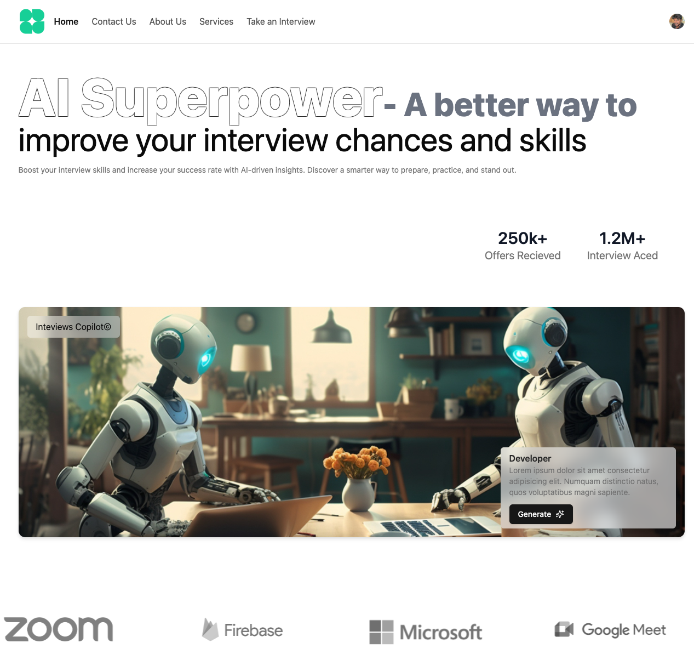

# React AI Mock Interview

React AI Mock Interview is an innovative web application designed to simulate real-world mock interviews using AI. With seamless user authentication, an intuitive interface, and integration with advanced AI, this project serves as an invaluable tool for interview preparation.

## Prerequisites

- [Node.js](https://nodejs.org/) (v18+ recommended)
- [Firebase CLI](https://firebase.google.com/docs/cli) (`npm install -g firebase-tools`)
- [pnpm](https://pnpm.io/) (`npm i -g pnpm`)

## Assets

Download UI and branding assets from [Google Drive](https://drive.google.com/drive/folders/1aAiHz6FApIc2IXOsq-TOHHZYcu-aAvrN?usp=drive_link) and place them in the project root as needed.



## Features

- **AI-Powered Mock Interviews:**  
  Leverage Google Gemini AI to simulate realistic interview scenarios, evaluate responses, and provide personalized feedback.
- **Seamless Authentication:**  
  User authentication powered by Clerk for secure access control.
- **Intuitive UI:**  
  Built with Shadcn UI for a modern, responsive experience.
- **Data Management:**  
  User progress and analytics stored securely in Google Firebase Firestore.
- **Dynamic Interview Customization:**  
  Customize interviews by job role, difficulty, and domain.

---

## Tech Stack

- **Frontend:** React.js
- **Authentication:** Clerk
- **UI Framework:** Shadcn UI
- **Database:** Google Firebase Firestore
- **AI Integration:** Google Gemini AI

---

## Getting Started

### Installation

#### Clone this repository:

```
git clone https://github.com/Vetrivel-VP/react-typescript-ai-mock-interview-november-2024.git
```

#### Navigate to the project directory:

```
cd react-typescript-ai-mock-interview-november-2024
```

#### Install dependencies

```
pnpm install
```

#### Start the development server

```
pnpm run dev
```

#### Firebase Initialization

```
firebase init
```

#### Firebase Deploy

```
firebase deploy
```

#### Project Build

```
pnpm run build
```

## Environment Variables

Create a `.env` file in the project root and add:

```
VITE_FIREBASE_API_KEY=YOUR_API_KEY_REF
VITE_FIREBASE_AUTH_DOMAIN=YOUR_API_KEY_REF
VITE_FIREBASE_PROJECT_ID=YOUR_API_KEY_REF
VITE_FIREBASE_STORAGE_BUCKET=YOUR_API_KEY_REF
VITE_FIREBASE_MESSAGING_SENDER_ID=YOUR_API_KEY_REF
VITE_FIREBASE_APP_ID=YOUR_API_KEY_REF
```

## Key Features

- **AI-Driven Insights:**  
  Real-time feedback on interview performance, highlighting strengths and areas for improvement.
- **User-Friendly Dashboard:**  
  Track progress, access past interviews, and download performance reports.
- **Interactive Questionnaires:**  
  Diverse question types, including multiple-choice, scenario-based, and technical coding challenges.

---

## Author

### Vetrivel Ravi

- Founder of Mahalakshmi Design Studioz
- Full-Stack Web Developer with 7+ years of experience
- YouTube Channel: [Vetrivel Ravi](https://www.youtube.com/@vetrivelravi)
- Email: [vetrivelravi@example.com](mailto:vetrivelravi@example.com)

---

## License

This project is licensed under the MIT License.
